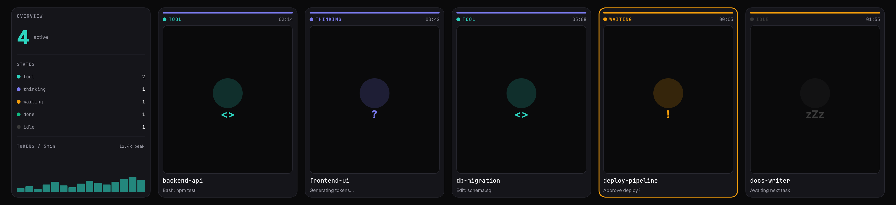

# AgentDeck

> See every AI Agent's state at a glance — no more tab-switching.

AgentDeck is a multi-AI-agent status visualizer for power users who run several Claude Code / Codex sessions in parallel. It surfaces every agent's current state on a long-strip secondary display below your monitor, pulses the whole strip when one needs your decision, and lets you respond from anywhere with a global hotkey.



## Status

**Alpha · MVP track.** The Windows build is the first target; macOS and Linux follow. Expect rough edges.

## What it does

- **Panorama view** — one card per running agent, color-coded by state (thinking / tool / waiting / done / idle)
- **Pending-decision highlight** — when an agent needs input, the leftmost card swaps to a focused prompt view with an amber halo
- **Zero window-switching** — global hotkeys (planned) let you approve, deny, or pick an agent from anywhere
- **Hooks-only, no file scraping** — taps into each AI tool's official event hooks (`~/.claude/settings.json` for Claude Code; Codex notify/approval), so there's nothing to read, parse, or scrape
- **Open protocol** — adapters are tiny scripts that POST events over localhost HTTP; any AI tool with an event stream can plug in

## Form factor

- **Now** — pure software. Bring your own 8.8″ 1920×480 long-strip USB-C display (commonly available on Amazon / Taobao for ~$60-90).
- **Later** — official recommended hardware bundle, then a custom-built strip display.

## Install

Grab the latest installer from the [Releases](https://github.com/arilink/AgentDeck/releases) page:

- **Windows** — `AgentDeck-Setup-x.y.z.exe` (NSIS installer; auto-updates on launch via electron-updater)
- **macOS / Linux** — coming soon

On first launch, AgentDeck registers itself in `~/.claude/settings.json` so Claude Code starts forwarding events. Run with `AGENTDECK_SKIP_HOOKS=1` to opt out of the auto-bootstrap.

## Quick start with Claude Code

1. Install AgentDeck.
2. Open any project in Claude Code.
3. The strip lights up the moment Claude starts thinking. That's it.

## Architecture

```
┌─────────────────────────────────────────────┐
│  Frontend (Svelte 5 + Vite, in Electron)    │
│  ↕ WebSocket (JSON, 127.0.0.1:7892)         │
│  Backend (Node.js — Rust port planned)      │
│  ↕ HTTP POST (JSON, 127.0.0.1:7891)         │
│  Adapters (per-tool hook bridges)           │
└─────────────────────────────────────────────┘
```

The three tiers talk over JSON, never function calls — any tier can be rewritten without touching the other two. The Node backend will eventually move to Rust (Tauri) without front-end or adapter changes.

## Supported AI tools

| Tool            | Status |
|-----------------|--------|
| Claude Code     | MVP — via `~/.claude/settings.json` hooks |
| Codex CLI       | Planned (notify / approval hooks) |
| Cursor          | Watching — no official hooks yet |
| GitHub Copilot  | Watching — no official hooks yet |

## License

MIT (see [LICENSE](LICENSE) once published).

---

Built by [@arilink](https://github.com/arilink). Issues & feature requests welcome.
